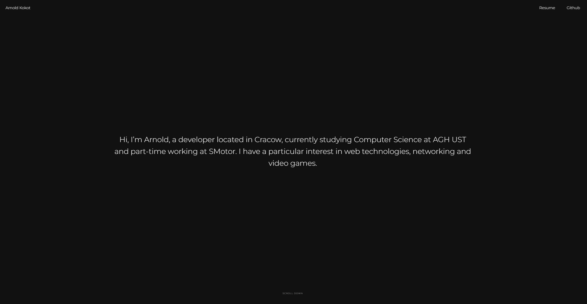

<br />
<p align="center">

  <h3 align="center">Portfolio website</h3>

  <p align="center">
    Website for arnoldkokot.com built with React.
    <br />
    <a href="https://arnoldkokot.com"><strong>View website »</strong></a>
    <br />
    <br />
    <a href="https://github.com/arnoldkokot/portfolio/issues">Report bug</a>
    ·
    <a href="https://github.com/arnoldkokot/portfolio/issues">Request Feature</a>
  </p>
</p>

<!-- TABLE OF CONTENTS -->
<details>
  <summary>Table of Contents</summary>
  <ol>
    <li>
      <a href="#about-the-project">About The Project</a>
      <ul>
        <li><a href="#commands">Commands</a></li>
        <li><a href="#built-with">Built With</a></li>
      </ul>
    </li>
    <li>
      <a href="#getting-started">Getting Started</a>
      <ul>
        <li><a href="#prerequisites">Prerequisites</a></li>
        <li><a href="#installation">Installation</a></li>
      </ul>
    </li>
    <li><a href="#license">License</a></li>
    <li><a href="#contact">Contact</a></li>
    <li><a href="#acknowledgements">Acknowledgements</a></li>
  </ol>
</details>

## About The Project

[](https://arnoldkokot.com)

### Built With

Major tools and websites.

- [React](https://reactjs.org/)
- [React-router](https://reactrouter.com/)
- [React-spring](https://react-spring.io/)

## Getting Started

If you would like to see how the project works you may want to install it on your machine.

To get a local copy up and running follow steps below.

### Prerequisites

Node and npm are required to install and run the project.

### Installation

1. Clone the repo
   ```sh
   git clone https://github.com/arnoldkokot/portfolio.git
   ```
2. Install NPM packages
   ```sh
   npm install
   ```
3. Run on your machine
   ```sh
   npm start
   ```

## License

Distributed under the MIT License. See `LICENSE` for more information.

## Contact

Arnold Kokot - [@deithyy](https://twitter.com/deithyy) - ogkokot@gmail.com
